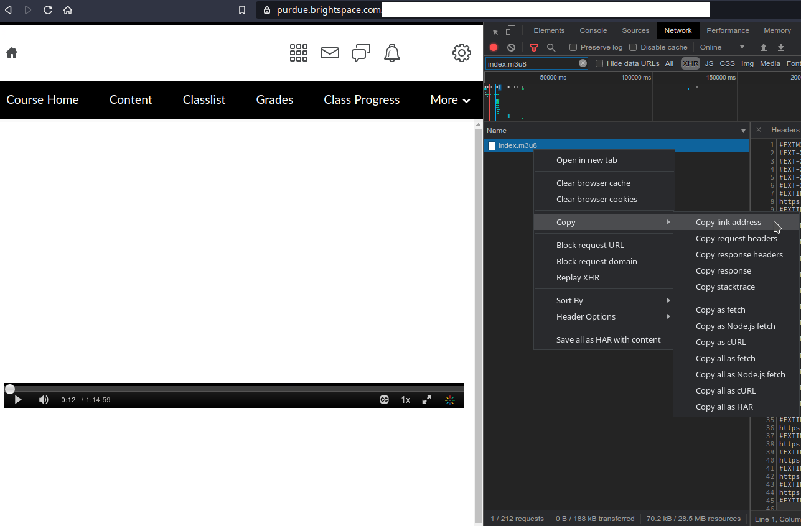

# Download streams from brightspace

- Begin with starting up the developer tools on your browser, in my browser it is Ctrl+shift+i.
- Select *Network* in the top pane.
- Use *index.m3u8* as search criteria.
- Start the video stream.
- Copy the link address, example:



Go to terminal or command line
```bash
$ ffmpeg -i https://<link>/index.m3u8 -c copy vid_file.mp4
```

# Crop video streams

An example of cropping the first left half of the video

```bash
$ ffmpeg -i vid_file.mp4 -filter:v "crop=in_w/2:in_h:0:0" -c:a copy vid_file_out.mp4
```

Note: this will keep the CPU quite busy.

# Crop black borders in VLC

Toggle between crop modes in VLC can be done by pressing **c**